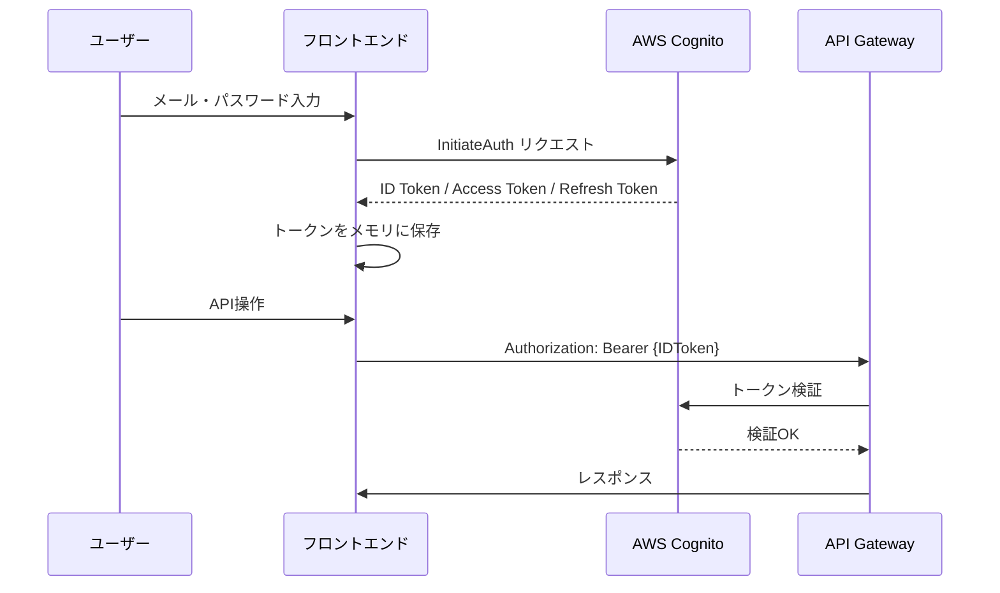
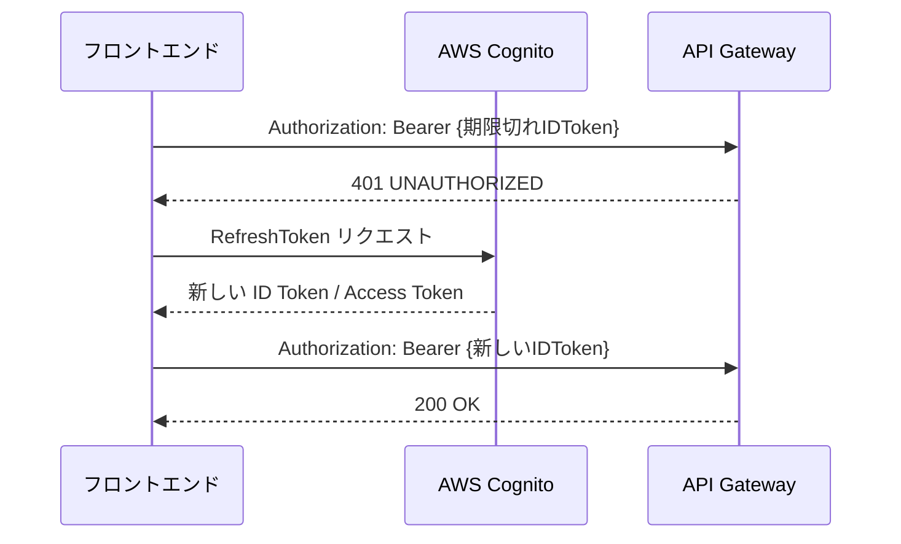
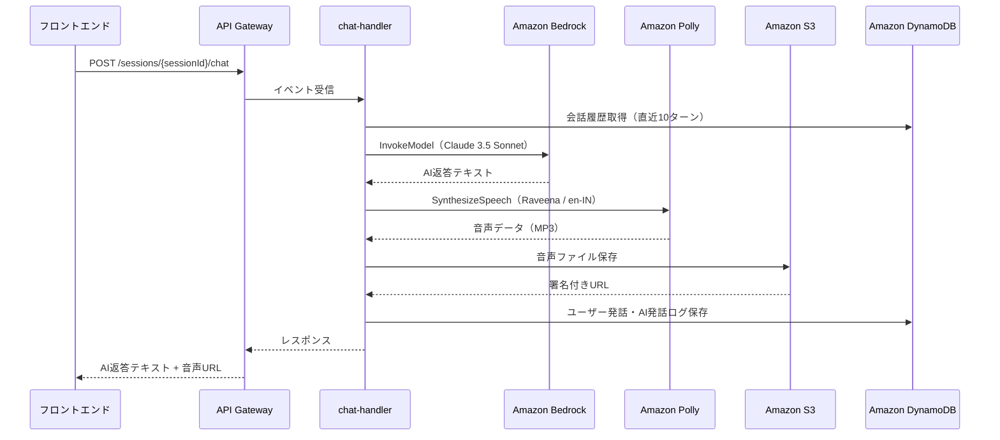
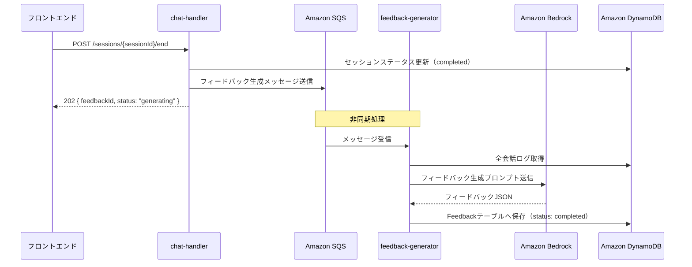

# IT-English Trainee (AWS Edition) API設計書

## 1. 概要

| 項目           | 内容                                              |
| ------------ | ----------------------------------------------- |
| ベースURL       | <https://api.it-english-trainee.example.com/v1> |
| 認証方式         | Bearer Token（Cognito ID Token）                  |
| Content-Type | application/json                                |
| 文字コード        | UTF-8                                           |

### 共通リクエストヘッダー

| ヘッダー名         |  必須 | 説明               |
| ------------- | :-: | ---------------- |
| Authorization |  ✓  | Bearer {IDToken} |
| Content-Type  |  ✓  | application/json |

### 共通レスポンス形式（成功時）

```json
{
  "success": true,
  "data": {},
  "error": null
}
```

### 共通エラーレスポンス形式

```json
{
  "success": false,
  "data": null,
  "error": {
    "code": "UNAUTHORIZED",
    "message": "認証トークンが無効です",
    "details": {}
  }
}
```

---

## 2. エンドポイント一覧

| #  | メソッド | パス                           | 機能名          | 機能ID        |  認証 |
| -- | ---- | ---------------------------- | ------------ | ----------- | :-: |
| 1  | GET  | `/users/me`                  | ユーザープロフィール取得 | F-002       |  ✓  |
| 2  | PUT  | `/users/me`                  | ユーザープロフィール更新 | F-002       |  ✓  |
| 3  | GET  | `/scenarios`                 | シナリオ一覧取得     | F-003       |  ✓  |
| 4  | GET  | `/scenarios/{scenarioId}`    | シナリオ詳細取得     | F-003       |  ✓  |
| 5  | POST | `/sessions`                  | セッション開始      | F-004〜F-007 |  ✓  |
| 6  | POST | `/sessions/{sessionId}/chat` | チャット送信       | F-004〜F-007 |  ✓  |
| 7  | POST | `/sessions/{sessionId}/end`  | セッション終了      | F-008       |  ✓  |
| 8  | GET  | `/sessions/{sessionId}`      | セッション取得      | F-007       |  ✓  |
| 9  | GET  | `/feedbacks/{feedbackId}`    | フィードバック取得    | F-008       |  ✓  |
| 10 | GET  | `/users/me/history`          | 学習履歴取得       | F-009       |  ✓  |
| 11 | GET  | `/users/me/dashboard`        | ダッシュボード取得    | F-010・F-011 |  ✓  |

---

## 3. エンドポイント詳細

### 3.1 ユーザー管理

#### GET /users/me

ログインユーザーのプロフィールを取得する。

| 項目       | 内容          |
| -------- | ----------- |
| メソッド     | GET         |
| パス       | `/users/me` |
| 認証       | 必須          |
| リクエストボディ | なし          |

**レスポンス（200 OK）**

```json
{
  "success": true,
  "data": {
    "userId": "usr_abc123",
    "name": "田中 太郎",
    "englishLevel": "Intermediate",
    "learningGoal": "インド人エンジニアとスムーズに会話できるようになる",
    "createdAt": "2025-01-01T00:00:00Z"
  }
}
```

**エラーレスポンス**

| HTTPステータス | エラーコード           | 説明               |
| --------- | ---------------- | ---------------- |
| 401       | `UNAUTHORIZED`   | 認証トークンが無効または期限切れ |
| 404       | `USER_NOT_FOUND` | ユーザーが存在しない       |

---

#### PUT /users/me

ログインユーザーのプロフィールを更新する。

| 項目   | 内容          |
| ---- | ----------- |
| メソッド | PUT         |
| パス   | `/users/me` |
| 認証   | 必須          |

**リクエストボディ**

```json
{
  "name": "田中 太郎",
  "englishLevel": "Intermediate",
  "learningGoal": "インド人エンジニアとスムーズに会話できるようになる"
}
```

| フィールド          | 型      |  必須 | 説明                                       |
| -------------- | ------ | :-: | ---------------------------------------- |
| `name`         | string |  ✓  | ユーザー表示名                                  |
| `englishLevel` | string |  ✓  | `Beginner` / `Intermediate` / `Advanced` |
| `learningGoal` | string |  -  | 学習目標テキスト                                 |

**レスポンス（200 OK）**

```json
{
  "success": true,
  "data": {
    "userId": "usr_abc123",
    "name": "田中 太郎",
    "englishLevel": "Intermediate",
    "updatedAt": "2025-06-01T10:00:00Z"
  }
}
```

**エラーレスポンス**

| HTTPステータス | エラーコード             | 説明               |
| --------- | ------------------ | ---------------- |
| 400       | `VALIDATION_ERROR` | リクエストパラメータが不正    |
| 401       | `UNAUTHORIZED`     | 認証トークンが無効または期限切れ |

---

### 3.2 シナリオ管理

#### GET /scenarios

シナリオ一覧を取得する。

| 項目   | 内容           |
| ---- | ------------ |
| メソッド | GET          |
| パス   | `/scenarios` |
| 認証   | 必須           |

**クエリパラメータ**

| パラメータ        | 型      |  必須 | 説明                                       |
| ------------ | ------ | :-: | ---------------------------------------- |
| `difficulty` | string |  -  | `Beginner` / `Intermediate` / `Advanced` |

**レスポンス（200 OK）**

```json
{
  "success": true,
  "data": {
    "scenarios": [
      {
        "scenarioId": "SCN-001",
        "title": "進捗報告とブロック",
        "description": "予期せぬバグによる遅延報告と、今日の予定調整。",
        "scene": "朝会",
        "difficulty": "Beginner",
        "lastScore": 82,
        "lastPlayedAt": "2025-05-30T09:00:00Z"
      }
    ]
  }
}
```

**エラーレスポンス**

| HTTPステータス | エラーコード         | 説明               |
| --------- | -------------- | ---------------- |
| 401       | `UNAUTHORIZED` | 認証トークンが無効または期限切れ |

---

#### GET /scenarios/{scenarioId}

シナリオ詳細を取得する。

| 項目   | 内容                        |
| ---- | ------------------------- |
| メソッド | GET                       |
| パス   | `/scenarios/{scenarioId}` |
| 認証   | 必須                        |

**パスパラメータ**

| パラメータ        | 型      |  必須 | 説明                  |
| ------------ | ------ | :-: | ------------------- |
| `scenarioId` | string |  ✓  | シナリオID（例：`SCN-001`） |

**レスポンス（200 OK）**

```json
{
  "success": true,
  "data": {
    "scenarioId": "SCN-001",
    "title": "進捗報告とブロック",
    "description": "予期せぬバグによる遅延報告と、今日の予定調整。",
    "scene": "朝会",
    "difficulty": "Beginner",
    "initialMessage": "Good morning! Ready for the standup? What's your update today?"
  }
}
```

**エラーレスポンス**

| HTTPステータス | エラーコード               | 説明               |
| --------- | -------------------- | ---------------- |
| 401       | `UNAUTHORIZED`       | 認証トークンが無効または期限切れ |
| 404       | `SCENARIO_NOT_FOUND` | シナリオが存在しない       |

---

### 3.3 セッション管理

#### POST /sessions

新しい対話セッションを開始する。

| 項目   | 内容          |
| ---- | ----------- |
| メソッド | POST        |
| パス   | `/sessions` |
| 認証   | 必須          |

**リクエストボディ**

```json
{
  "scenarioId": "SCN-001"
}
```

| フィールド        | 型      |  必須 | 説明         |
| ------------ | ------ | :-: | ---------- |
| `scenarioId` | string |  ✓  | 開始するシナリオID |

**レスポンス（201 Created）**

```json
{
  "success": true,
  "data": {
    "sessionId": "ses_xyz789",
    "scenarioId": "SCN-001",
    "initialMessage": "Good morning! Ready for the standup? What's your update today?",
    "audioUrl": "https://s3.amazonaws.com/...signed-url...",
    "createdAt": "2025-06-01T09:00:00Z"
  }
}
```

**エラーレスポンス**

| HTTPステータス | エラーコード               | 説明               |
| --------- | -------------------- | ---------------- |
| 400       | `VALIDATION_ERROR`   | リクエストパラメータが不正    |
| 401       | `UNAUTHORIZED`       | 認証トークンが無効または期限切れ |
| 404       | `SCENARIO_NOT_FOUND` | シナリオが存在しない       |

---

#### POST /sessions/{sessionId}/chat

ユーザーの発話を送信し、AIの返答を取得する。

| 項目   | 内容                           |
| ---- | ---------------------------- |
| メソッド | POST                         |
| パス   | `/sessions/{sessionId}/chat` |
| 認証   | 必須                           |

**パスパラメータ**

| パラメータ       | 型      |  必須 | 説明      |
| ----------- | ------ | :-: | ------- |
| `sessionId` | string |  ✓  | セッションID |

**リクエストボディ**

```json
{
  "userMessage": "I'm sorry, I found a critical bug in the payment module. It will take at least 2 more days.",
  "messageType": "text"
}
```

| フィールド         | 型      |  必須 | 説明          |
| ------------- | ------ | :-: | ----------- |
| `userMessage` | string |  ✓  | ユーザーの発話テキスト |
| `messageType` | string |  ✓  | `text`（固定）  |

**レスポンス（200 OK）**

```json
{
  "success": true,
  "data": {
    "chatLogId": "log_def456",
    "aiMessage": "I see That's quite serious. Have you already informed the project manager about this delay?",
    "audioUrl": "https://s3.amazonaws.com/...signed-url...",
    "translation": "なるほど、それは深刻ですね。この遅延についてはすでにプロジェクトマネージャーに報告しましたか？",
    "timestamp": "2025-06-01T09:01:30Z"
  }
}
```

**エラーレスポンス**

| HTTPステータス | エラーコード                   | 説明                      |
| --------- | ------------------------ | ----------------------- |
| 400       | `VALIDATION_ERROR`       | リクエストパラメータが不正           |
| 401       | `UNAUTHORIZED`           | 認証トークンが無効または期限切れ        |
| 404       | `SESSION_NOT_FOUND`      | セッションが存在しない             |
| 503       | `AI_SERVICE_UNAVAILABLE` | Bedrock呼び出し失敗（リトライ上限超過） |

---

#### POST /sessions/{sessionId}/end

対話セッションを終了し、フィードバック生成をトリガーする。

| 項目   | 内容                          |
| ---- | --------------------------- |
| メソッド | POST                        |
| パス   | `/sessions/{sessionId}/end` |
| 認証   | 必須                          |

**パスパラメータ**

| パラメータ       | 型      |  必須 | 説明      |
| ----------- | ------ | :-: | ------- |
| `sessionId` | string |  ✓  | セッションID |

**リクエストボディ** なし

**レスポンス（200 OK）**

```json
{
  "success": true,
  "data": {
    "sessionId": "ses_xyz789",
    "feedbackId": "fbk_ghi012",
    "status": "generating"
  }
}
```

**エラーレスポンス**

| HTTPステータス | エラーコード              | 説明               |
| --------- | ------------------- | ---------------- |
| 401       | `UNAUTHORIZED`      | 認証トークンが無効または期限切れ |
| 404       | `SESSION_NOT_FOUND` | セッションが存在しない      |

---

#### GET /sessions/{sessionId}

セッション情報と会話ログを取得する。

| 項目   | 内容                      |
| ---- | ----------------------- |
| メソッド | GET                     |
| パス   | `/sessions/{sessionId}` |
| 認証   | 必須                      |

**パスパラメータ**

| パラメータ       | 型      |  必須 | 説明      |
| ----------- | ------ | :-: | ------- |
| `sessionId` | string |  ✓  | セッションID |

**レスポンス（200 OK）**

```json
{
  "success": true,
  "data": {
    "sessionId": "ses_xyz789",
    "scenarioId": "SCN-001",
    "status": "completed",
    "chatLogs": [
      {
        "chatLogId": "log_def456",
        "speaker": "AI",
        "messageText": "Good morning! Ready for the standup?",
        "audioUrl": "https://s3.amazonaws.com/...signed-url...",
        "timestamp": "2025-06-01T09:00:00Z"
      }
    ],
    "createdAt": "2025-06-01T09:00:00Z"
  }
}
```

**エラーレスポンス**

| HTTPステータス | エラーコード              | 説明               |
| --------- | ------------------- | ---------------- |
| 401       | `UNAUTHORIZED`      | 認証トークンが無効または期限切れ |
| 404       | `SESSION_NOT_FOUND` | セッションが存在しない      |

---

### 3.4 フィードバック

#### GET /feedbacks/{feedbackId}

フィードバック結果を取得する。

| 項目   | 内容                        |
| ---- | ------------------------- |
| メソッド | GET                       |
| パス   | `/feedbacks/{feedbackId}` |
| 認証   | 必須                        |

**パスパラメータ**

| パラメータ        | 型      |  必須 | 説明        |
| ------------ | ------ | :-: | --------- |
| `feedbackId` | string |  ✓  | フィードバックID |

**レスポンス（200 OK）**

```json
{
  "success": true,
  "data": {
    "feedbackId": "fbk_ghi012",
    "sessionId": "ses_xyz789",
    "scenarioId": "SCN-001",
    "overallScore": 78,
    "grade": "B",
    "scores": {
      "grammar": 80,
      "fluency": 75,
      "itVocabulary": 79
    },
    "corrections": [
      {
        "original": "I found a critical bug",
        "improved": "I've identified a critical bug",
        "explanation": "現在完了形を使うことで、直前に発見したことをより自然に表現できます。"
      }
    ],
    "keyPhrases": [
      {
        "phrase": "I need to flag a blocker",
        "usage": "作業を妨げる問題（ブロッカー）を報告する際の定番フレーズ",
        "example": "I need to flag a blocker — the API endpoint is returning 500 errors."
      }
    ],
    "overallComment": "全体的に意思疎通はできていますが、IT現場特有のフレーズを積極的に使うとより自然な会話になります。",
    "status": "completed",
    "createdAt": "2025-06-01T09:10:00Z"
  }
}
```

**エラーレスポンス**

| HTTPステータス | エラーコード                | 説明                     |
| --------- | --------------------- | ---------------------- |
| 401       | `UNAUTHORIZED`        | 認証トークンが無効または期限切れ       |
| 404       | `FEEDBACK_NOT_FOUND`  | フィードバックが存在しない          |
| 202       | `FEEDBACK_GENERATING` | フィードバック生成中（再度取得してください） |

---

### 3.5 学習履歴・ダッシュボード

#### GET /users/me/history

学習履歴一覧を取得する。

| 項目   | 内容                  |
| ---- | ------------------- |
| メソッド | GET                 |
| パス   | `/users/me/history` |
| 認証   | 必須                  |

**クエリパラメータ**

| パラメータ        | 型       |  必須 | 説明                                |
| ------------ | ------- | :-: | --------------------------------- |
| `scenarioId` | string  |  -  | シナリオIDで絞り込み                       |
| `period`     | string  |  -  | `7d` / `30d` / `all`（デフォルト：`30d`） |
| `limit`      | integer |  -  | 取得件数（デフォルト：20）                    |
| `offset`     | integer |  -  | オフセット（デフォルト：0）                    |

**レスポンス（200 OK）**

```json
{
  "success": true,
  "data": {
    "summary": {
      "totalCount": 15,
      "averageScore": 76,
      "highestScore": 92,
      "streakDays": 5
    },
    "history": [
      {
        "feedbackId": "fbk_ghi012",
        "scenarioId": "SCN-001",
        "scenarioTitle": "進捗報告とブロック",
        "overallScore": 78,
        "grade": "B",
        "playedAt": "2025-06-01T09:00:00Z"
      }
    ],
    "total": 15,
    "limit": 20,
    "offset": 0
  }
}
```

**エラーレスポンス**

| HTTPステータス | エラーコード         | 説明               |
| --------- | -------------- | ---------------- |
| 401       | `UNAUTHORIZED` | 認証トークンが無効または期限切れ |

---

#### GET /users/me/dashboard

進捗ダッシュボードデータを取得する。

| 項目       | 内容                    |
| -------- | --------------------- |
| メソッド     | GET                   |
| パス       | `/users/me/dashboard` |
| 認証       | 必須                    |
| リクエストボディ | なし                    |

**レスポンス（200 OK）**

```json
{
  "success": true,
  "data": {
    "weeklyCount": 7,
    "streakDays": 5,
    "averageScore": 76,
    "dailyScores": [
      { "date": "2025-05-26", "score": 70 },
      { "date": "2025-05-27", "score": 74 },
      { "date": "2025-05-28", "score": 78 },
      { "date": "2025-05-29", "score": 75 },
      { "date": "2025-05-30", "score": 82 },
      { "date": "2025-05-31", "score": null },
      { "date": "2025-06-01", "score": 78 }
    ],
    "recommendedScenario": {
      "scenarioId": "SCN-003",
      "title": "設計相談",
      "reason": "IT用語スコアが最も低いシナリオです。重点的に練習しましょう。"
    }
  }
}
```

**エラーレスポンス**

| HTTPステータス | エラーコード         | 説明               |
| --------- | -------------- | ---------------- |
| 401       | `UNAUTHORIZED` | 認証トークンが無効または期限切れ |

---

## 4. 共通エラーコード

| エラーコード                   | HTTPステータス | 説明                      | 対処方法                 |
| ------------------------ | :-------: | ----------------------- | -------------------- |
| `UNAUTHORIZED`           |    401    | 認証トークンが無効または期限切れ        | トークンをリフレッシュして再リクエスト  |
| `FORBIDDEN`              |    403    | アクセス権限がない               | 権限を確認する              |
| `USER_NOT_FOUND`         |    404    | ユーザーが存在しない              | ユーザーIDを確認する          |
| `SCENARIO_NOT_FOUND`     |    404    | シナリオが存在しない              | シナリオIDを確認する          |
| `SESSION_NOT_FOUND`      |    404    | セッションが存在しない             | セッションIDを確認する         |
| `FEEDBACK_NOT_FOUND`     |    404    | フィードバックが存在しない           | フィードバックIDを確認する       |
| `FEEDBACK_GENERATING`    |    202    | フィードバック生成中              | 数秒後に再度GETリクエストを送信する  |
| `VALIDATION_ERROR`       |    400    | リクエストパラメータが不正           | リクエストボディ・パラメータを確認する  |
| `CONFLICT`               |    409    | リソースが既に存在する             | 重複リクエストを確認する         |
| `AI_SERVICE_UNAVAILABLE` |    503    | Bedrock呼び出し失敗（リトライ上限超過） | しばらく待ってから再試行する       |
| `INTERNAL_SERVER_ERROR`  |    500    | サーバー内部エラー               | CloudWatch Logsを確認する |

---

## 5. 認証フロー

### 5.1 ログイン・トークン取得フロー



### 5.2 トークンリフレッシュフロー



### 5.3 トークン仕様

| トークン種別        | 有効期限 | 用途                             |
| ------------- | :--: | ------------------------------ |
| ID Token      |  1時間 | API Gatewayの認証ヘッダーに使用          |
| Access Token  |  1時間 | Cognitoユーザー情報へのアクセスに使用         |
| Refresh Token |  30日 | ID Token / Access Tokenの再発行に使用 |

---

## 6. Lambda関数マッピング

### 6.1 エンドポイント対応表

| #  | エンドポイント                         | Lambda関数名          | 処理概要                               |
| -- | ------------------------------- | ------------------ | ---------------------------------- |
| 1  | GET /users/me                   | `user-handler`     | DynamoDB Userテーブルから取得              |
| 2  | PUT /users/me                   | `user-handler`     | DynamoDB Userテーブルを更新               |
| 3  | GET /scenarios                  | `scenario-handler` | DynamoDB Scenarioテーブルから一覧取得        |
| 4  | GET /scenarios/{scenarioId}     | `scenario-handler` | DynamoDB Scenarioテーブルから詳細取得        |
| 5  | POST /sessions                  | `chat-handler`     | セッション作成・初期メッセージ生成（Bedrock + Polly） |
| 6  | POST /sessions/{sessionId}/chat | `chat-handler`     | AI返答生成（Bedrock + Polly）・ログ保存       |
| 7  | POST /sessions/{sessionId}/end  | `chat-handler`     | セッション終了・SQSへフィードバック生成依頼            |
| 8  | GET /sessions/{sessionId}       | `chat-handler`     | セッション情報・会話ログ取得                     |
| 9  | GET /feedbacks/{feedbackId}     | `feedback-handler` | DynamoDB Feedbackテーブルから取得          |
| 10 | GET /users/me/history           | `history-handler`  | DynamoDB Feedbackテーブルをユーザーでクエリ     |
| 11 | GET /users/me/dashboard         | `history-handler`  | 学習データ集計・推奨シナリオ算出                   |

### 6.2 チャット処理フロー（POST /sessions/{sessionId}/chat）



### 6.3 フィードバック生成フロー（非同期）



---

## 7. 非機能要件

### 7.1 レイテンシ目標

| エンドポイント                         | 目標レイテンシ | 備考                     |
| ------------------------------- | :-----: | ---------------------- |
| GET /users/me                   | < 200ms | DynamoDB単純取得           |
| GET /scenarios                  | < 300ms | DynamoDB取得 + スコア結合     |
| POST /sessions                  |   < 3s  | Bedrock + Polly呼び出しを含む |
| POST /sessions/{sessionId}/chat |   < 5s  | Bedrock + Polly呼び出しを含む |
| POST /sessions/{sessionId}/end  | < 500ms | SQS送信のみ（フィードバック生成は非同期） |
| GET /feedbacks/{feedbackId}     | < 200ms | DynamoDB単純取得           |
| GET /users/me/dashboard         | < 500ms | 集計処理を含む                |

### 7.2 リトライ方針

| 対象サービス          | リトライ回数 | バックオフ               | 備考            |
| --------------- | :----: | ------------------- | ------------- |
| Amazon Bedrock  |  最大3回  | Exponential Backoff | スロットリング対策     |
| Amazon Polly    |  最大3回  | Exponential Backoff | -             |
| Amazon DynamoDB |  最大3回  | Exponential Backoff | SDK自動リトライ     |
| Amazon SQS      |  最大3回  | Exponential Backoff | DLQへ転送後アラート通知 |

### 7.3 スロットリング

| 設定                | 値         | 備考          |
| ----------------- | --------- | ----------- |
| API Gatewayバースト上限 | 100 req/s | アカウントデフォルト  |
| API Gatewayレート上限  | 50 req/s  | ステージ設定      |
| Lambda同時実行数       | 100       | アカウント上限内で設定 |

### 7.4 セキュリティ

| 項目       | 内容                                    |
| -------- | ------------------------------------- |
| 認証       | Cognito ID Tokenによる全エンドポイント認証必須       |
| 通信暗号化    | HTTPS（TLS 1.2以上）必須                    |
| シークレット管理 | APIキー・DB接続情報はAWS Secrets Manager経由で取得 |
| CORS     | フロントエンドドメインのみ許可                       |
| ログ       | CloudWatch Logsに構造化ログ（JSON）を出力        |
