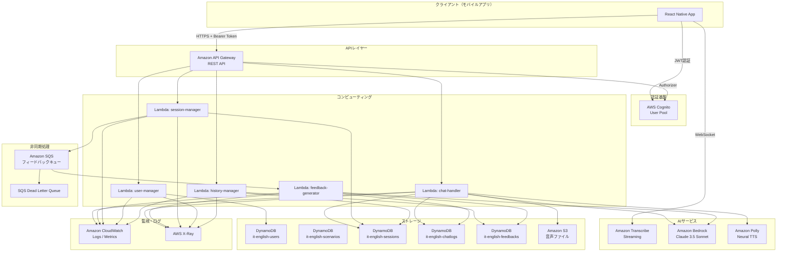
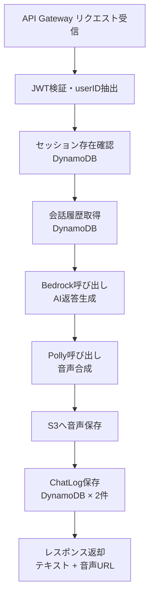
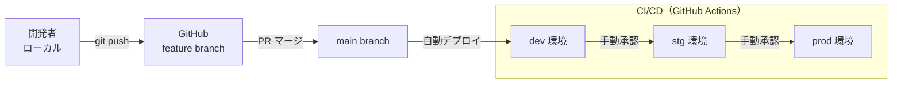

# IT-English Trainee (AWS Edition) インフラ構成書

## 1. AWSアーキテクチャ概要図



---

## 2. 各AWSサービスの役割と設定

### 2.1 サービス一覧

| サービス | 役割 | リージョン |
|---------|------|-----------|
| Amazon Cognito | ユーザー認証・JWT発行 | ap-northeast-1 |
| Amazon API Gateway | REST APIエンドポイント管理・認証 | ap-northeast-1 |
| AWS Lambda | サーバーレスビジネスロジック実行 | ap-northeast-1 |
| Amazon Transcribe | 音声→テキスト変換（STT） | ap-northeast-1 |
| Amazon Bedrock | AI対話生成・フィードバック生成（LLM） | us-east-1 ※1 |
| Amazon Polly | テキスト→音声変換（TTS） | ap-northeast-1 |
| Amazon DynamoDB | NoSQLデータストア | ap-northeast-1 |
| Amazon S3 | 音声ファイルストレージ | ap-northeast-1 |
| Amazon SQS | フィードバック非同期処理キュー | ap-northeast-1 |
| Amazon CloudWatch | ログ収集・メトリクス監視・アラート | ap-northeast-1 |
| AWS X-Ray | 分散トレーシング | ap-northeast-1 |
| AWS Secrets Manager | APIキー・機密情報管理 | ap-northeast-1 |

> ※1 Amazon Bedrock の Claude 3.5 Sonnet は `us-east-1` または `us-west-2` で利用可能。クロスリージョン呼び出しを使用する。

---

## 3. AWS Cognito 設定

### 3.1 User Pool 設定

| 項目 | 設定値 |
|------|--------|
| User Pool 名 | `it-english-trainee-user-pool-{env}` |
| サインイン方式 | メールアドレス |
| パスワードポリシー | 最小8文字、大文字・小文字・数字・記号を各1文字以上 |
| MFA | オプション（TOTP） |
| メール確認 | 必須（確認コード送信） |
| トークン有効期限（ID Token） | 1時間 |
| トークン有効期限（Refresh Token） | 30日 |
| ユーザー属性 | `email`（必須）、`name`（必須）、`custom:englishLevel`、`custom:learningGoal` |

### 3.2 App Client 設定

| 項目 | 設定値 |
|------|--------|
| App Client 名 | `it-english-trainee-app-client-{env}` |
| 認証フロー | `ALLOW_USER_SRP_AUTH`、`ALLOW_REFRESH_TOKEN_AUTH` |
| クライアントシークレット | 無効（モバイルアプリのため） |
| OAuth フロー | 不使用（直接認証） |

### 3.3 API Gateway Authorizer 設定

| 項目 | 設定値 |
|------|--------|
| Authorizer タイプ | Cognito User Pool Authorizer |
| Token ソース | `Authorization` ヘッダー（Bearer Token） |
| 検証対象 | ID Token |

---

## 4. Amazon API Gateway 設定

### 4.1 基本設定

| 項目 | 設定値 |
|------|--------|
| API タイプ | REST API |
| API 名 | `it-english-trainee-api-{env}` |
| エンドポイントタイプ | Regional |
| ステージ名 | `v1` |
| ベースURL | `https://{api-id}.execute-api.ap-northeast-1.amazonaws.com/v1` |

### 4.2 エンドポイント一覧

| メソッド | パス | Lambda 関数 | 認証 |
|---------|------|------------|------|
| GET | `/users/me` | `user-manager` | Cognito |
| PUT | `/users/me` | `user-manager` | Cognito |
| GET | `/users/me/dashboard` | `history-manager` | Cognito |
| GET | `/users/me/history` | `history-manager` | Cognito |
| GET | `/scenarios` | `session-manager` | Cognito |
| POST | `/sessions` | `session-manager` | Cognito |
| POST | `/sessions/{sessionId}/chat` | `chat-handler` | Cognito |
| POST | `/sessions/{sessionId}/end` | `session-manager` | Cognito |
| GET | `/feedbacks/{feedbackId}` | `history-manager` | Cognito |

### 4.3 スロットリング設定

| 項目 | 設定値 |
|------|--------|
| デフォルトスロットリング（レート） | 100 リクエスト/秒 |
| デフォルトスロットリング（バースト） | 200 リクエスト |
| `/sessions/{sessionId}/chat` レート | 10 リクエスト/秒（ユーザーあたり） |

### 4.4 CORS 設定

| 項目 | 設定値 |
|------|--------|
| Access-Control-Allow-Origin | `*`（開発環境）/ アプリドメイン（本番） |
| Access-Control-Allow-Methods | `GET, POST, PUT, DELETE, OPTIONS` |
| Access-Control-Allow-Headers | `Content-Type, Authorization` |

---

## 5. AWS Lambda 関数一覧と設定

### 5.1 関数一覧

| 関数名 | 説明 | ランタイム | メモリ | タイムアウト | トリガー |
|--------|------|-----------|--------|------------|---------|
| `chat-handler` | AI対話処理（Bedrock + Polly） | Node.js 20.x | 512 MB | 30秒 | API Gateway |
| `feedback-generator` | フィードバック生成（Bedrock） | Node.js 20.x | 512 MB | 60秒 | SQS |
| `session-manager` | セッション管理・シナリオ取得 | Node.js 20.x | 256 MB | 10秒 | API Gateway |
| `user-manager` | ユーザープロフィール管理 | Node.js 20.x | 256 MB | 10秒 | API Gateway |
| `history-manager` | 学習履歴・ダッシュボード取得 | Node.js 20.x | 256 MB | 10秒 | API Gateway |

### 5.2 共通環境変数

| 変数名 | 値 | 説明 |
|--------|---|------|
| `ENV` | `dev` / `stg` / `prod` | 実行環境 |
| `DYNAMODB_REGION` | `ap-northeast-1` | DynamoDB リージョン |
| `BEDROCK_REGION` | `us-east-1` | Bedrock リージョン |
| `S3_BUCKET_AUDIO` | `it-english-trainee-audio-{env}` | 音声バケット名 |
| `AUDIO_PRESIGNED_URL_EXPIRES` | `3600` | 署名付きURL有効期限（秒） |

### 5.3 chat-handler 詳細設定

| 項目 | 設定値 |
|------|--------|
| 同時実行数（予約） | 50 |
| レイヤー | `aws-sdk-layer`（共通SDKライブラリ） |
| X-Ray トレーシング | Active |
| Dead Letter Queue | 不使用（同期処理のため） |

**処理フロー**



### 5.4 feedback-generator 詳細設定

| 項目 | 設定値 |
|------|--------|
| SQS バッチサイズ | 1 |
| 最大再試行回数 | 3 |
| 可視性タイムアウト | 120秒 |
| Dead Letter Queue | `it-english-feedback-dlq-{env}` |

---

## 6. Amazon Transcribe 設定

### 6.1 Streaming Transcription 設定

| 項目 | 設定値 |
|------|--------|
| API | `StartStreamTranscription`（WebSocket） |
| 言語コード | `en-US` |
| メディアエンコーディング | `pcm` |
| サンプルレート | `16000` Hz |
| 部分結果の安定化 | 有効（`EnablePartialResultsStabilization: true`） |
| 安定化レベル | `medium` |
| 最大録音時間 | 60秒 |

### 6.2 クライアント側実装方針

- フロントエンド（React Native）から直接 Transcribe Streaming API を呼び出す
- 認証には Cognito Identity Pool から取得した一時的なAWS認証情報を使用する
- WebSocket 接続は音声入力ボタン押下時に確立し、ボタンを離した時点で切断する

---

## 7. Amazon Bedrock 設定

### 7.1 モデル設定

| 項目 | 設定値 |
|------|--------|
| モデルID | `anthropic.claude-3-5-sonnet-20241022-v2:0` |
| リージョン | `us-east-1` |
| API | `InvokeModel`（同期） |
| `max_tokens` | `512`（対話生成）/ `2048`（フィードバック生成） |
| `temperature` | `0.7`（対話生成）/ `0.3`（フィードバック生成） |
| `top_p` | `0.9` |

### 7.2 アクセス設定

| 項目 | 設定値 |
|------|--------|
| モデルアクセス | AWS コンソールから Claude 3.5 Sonnet のアクセスを事前に有効化する |
| 呼び出し元 | Lambda 実行ロール（クロスリージョン呼び出し） |
| スロットリング対策 | Exponential Backoff による自動リトライ（最大3回） |

---

## 8. Amazon Polly 設定

### 8.1 音声合成設定

| 項目 | 設定値 |
|------|--------|
| API | `SynthesizeSpeech` |
| VoiceId | `Raveena`（インド英語・女性）/ `Kajal`（インド英語・女性・Neural） |
| Engine | `neural` |
| OutputFormat | `mp3` |
| LanguageCode | `en-IN` |
| SampleRate | `22050` |

### 8.2 代替音声設定

| 用途 | VoiceId | Engine | LanguageCode |
|------|---------|--------|-------------|
| デフォルト（インド英語） | `Kajal` | neural | `en-IN` |
| 代替（米国英語） | `Joanna` | neural | `en-US` |
| 代替（英国英語） | `Amy` | neural | `en-GB` |

---

## 9. Amazon DynamoDB 設定

### 9.1 テーブル設定一覧

| テーブル名 | PK | SK | キャパシティ | PITR | 暗号化 |
|-----------|----|----|------------|------|--------|
| `it-english-users-{env}` | `userId` (S) | - | オンデマンド | 有効 | AWS管理キー |
| `it-english-scenarios-{env}` | `scenarioId` (S) | - | プロビジョニング (RCU:5/WCU:1) | 有効 | AWS管理キー |
| `it-english-sessions-{env}` | `sessionId` (S) | - | オンデマンド | 有効 | AWS管理キー |
| `it-english-chatlogs-{env}` | `chatLogId` (S) | - | オンデマンド | 有効 | AWS管理キー |
| `it-english-feedbacks-{env}` | `feedbackId` (S) | - | オンデマンド | 有効 | AWS管理キー |

### 9.2 GSI 設定一覧

| テーブル | GSI名 | GSI-PK | GSI-SK | 射影 |
|---------|-------|--------|--------|------|
| sessions | `userId-createdAt-index` | `userId` (S) | `createdAt` (S) | ALL |
| sessions | `scenarioId-createdAt-index` | `scenarioId` (S) | `createdAt` (S) | ALL |
| chatlogs | `sessionId-timestamp-index` | `sessionId` (S) | `timestamp` (S) | ALL |
| chatlogs | `userId-timestamp-index` | `userId` (S) | `timestamp` (S) | KEYS_ONLY |
| feedbacks | `userId-createdAt-index` | `userId` (S) | `createdAt` (S) | ALL |
| feedbacks | `sessionId-index` | `sessionId` (S) | - | ALL |
| feedbacks | `userId-scenarioId-index` | `userId` (S) | `scenarioId` (S) | KEYS_ONLY |

### 9.3 TTL 設定

| テーブル | TTL 属性名 | 保持期間 | 備考 |
|---------|-----------|---------|------|
| `it-english-chatlogs` | `ttl` | 365日 | 古い会話ログの自動削除 |
| `it-english-sessions` | `ttl` | 365日 | 古いセッションの自動削除 |

---

## 10. Amazon S3 設定

### 10.1 バケット設定

| 項目 | 設定値 |
|------|--------|
| バケット名 | `it-english-trainee-audio-{env}` |
| リージョン | `ap-northeast-1` |
| パブリックアクセス | 全てブロック |
| バージョニング | 無効 |
| 暗号化 | SSE-S3（AES-256） |
| オブジェクトロック | 無効 |

### 10.2 ライフサイクルポリシー

| ルール名 | プレフィックス | アクション | 日数 |
|---------|-------------|---------|------|
| `move-to-glacier` | `audio/` | S3 Glacier Instant Retrieval へ移行 | 30日後 |
| `auto-delete` | `audio/` | 完全削除 | 90日後 |

### 10.3 CORS 設定

```json
[
  {
    "AllowedHeaders": ["*"],
    "AllowedMethods": ["GET", "PUT"],
    "AllowedOrigins": ["*"],
    "ExposeHeaders": ["ETag"],
    "MaxAgeSeconds": 3000
  }
]
```

---

## 11. Amazon SQS 設定

### 11.1 フィードバックキュー

| 項目 | 設定値 |
|------|--------|
| キュー名 | `it-english-feedback-queue-{env}` |
| キュータイプ | Standard Queue |
| 可視性タイムアウト | 120秒 |
| メッセージ保持期間 | 4日 |
| 最大メッセージサイズ | 256 KB |
| Dead Letter Queue | `it-english-feedback-dlq-{env}` |
| 最大受信数（DLQ転送） | 3回 |

### 11.2 Dead Letter Queue

| 項目 | 設定値 |
|------|--------|
| キュー名 | `it-english-feedback-dlq-{env}` |
| メッセージ保持期間 | 14日 |
| CloudWatch アラート | DLQ メッセージ数 > 0 で通知 |

---

## 12. IAM ロール・ポリシー設計

### 12.1 Lambda 実行ロール一覧

| ロール名 | 対象 Lambda | 付与ポリシー |
|---------|------------|------------|
| `it-english-chat-handler-role-{env}` | `chat-handler` | DynamoDB読み書き、Bedrock呼び出し、Polly呼び出し、S3書き込み、CloudWatch Logs |
| `it-english-feedback-generator-role-{env}` | `feedback-generator` | DynamoDB読み書き、Bedrock呼び出し、SQS受信・削除、CloudWatch Logs |
| `it-english-session-manager-role-{env}` | `session-manager` | DynamoDB読み書き、SQS送信、CloudWatch Logs |
| `it-english-user-manager-role-{env}` | `user-manager` | DynamoDB読み書き、CloudWatch Logs |
| `it-english-history-manager-role-{env}` | `history-manager` | DynamoDB読み取り、CloudWatch Logs |

### 12.2 chat-handler ロールポリシー（例）

```json
{
  "Version": "2012-10-17",
  "Statement": [
    {
      "Effect": "Allow",
      "Action": [
        "dynamodb:GetItem",
        "dynamodb:PutItem",
        "dynamodb:UpdateItem",
        "dynamodb:Query"
      ],
      "Resource": [
        "arn:aws:dynamodb:ap-northeast-1:*:table/it-english-sessions-*",
        "arn:aws:dynamodb:ap-northeast-1:*:table/it-english-chatlogs-*",
        "arn:aws:dynamodb:ap-northeast-1:*:table/it-english-chatlogs-*/index/*"
      ]
    },
    {
      "Effect": "Allow",
      "Action": [
        "bedrock:InvokeModel"
      ],
      "Resource": "arn:aws:bedrock:us-east-1::foundation-model/anthropic.claude-3-5-sonnet-20241022-v2:0"
    },
    {
      "Effect": "Allow",
      "Action": [
        "polly:SynthesizeSpeech"
      ],
      "Resource": "*"
    },
    {
      "Effect": "Allow",
      "Action": [
        "s3:PutObject",
        "s3:GetObject"
      ],
      "Resource": "arn:aws:s3:::it-english-trainee-audio-*/*"
    },
    {
      "Effect": "Allow",
      "Action": [
        "logs:CreateLogGroup",
        "logs:CreateLogStream",
        "logs:PutLogEvents"
      ],
      "Resource": "arn:aws:logs:*:*:*"
    },
    {
      "Effect": "Allow",
      "Action": [
        "xray:PutTraceSegments",
        "xray:PutTelemetryRecords"
      ],
      "Resource": "*"
    }
  ]
}
```

### 12.3 モバイルアプリ用 Cognito Identity Pool ロール

| ロール名 | 用途 | 付与ポリシー |
|---------|------|------------|
| `it-english-authenticated-role-{env}` | 認証済みユーザー | Transcribe Streaming 呼び出し |

```json
{
  "Effect": "Allow",
  "Action": [
    "transcribe:StartStreamTranscription"
  ],
  "Resource": "*"
}
```

---

## 13. 監視・アラート設定

### 13.1 CloudWatch アラート一覧

| アラート名 | メトリクス | 閾値 | 通知先 |
|-----------|---------|------|--------|
| Lambda エラー率上昇 | `Errors / Invocations > 5%` | 5分間 | SNS → メール |
| Lambda タイムアウト | `chat-handler Duration > 25秒` | 1回 | SNS → メール |
| API Gateway 5xx エラー | `5XXError > 10件/分` | 1分間 | SNS → メール |
| DLQ メッセージ蓄積 | `ApproximateNumberOfMessagesVisible > 0` | 即時 | SNS → メール |
| DynamoDB 読み取りスロットリング | `ReadThrottleEvents > 0` | 5分間 | SNS → メール |

### 13.2 CloudWatch ダッシュボード

| ウィジェット | 表示内容 |
|------------|---------|
| Lambda 呼び出し数 | 関数別の1時間あたり呼び出し数 |
| Lambda エラー数 | 関数別のエラー数推移 |
| API Gateway レイテンシ | P50 / P90 / P99 レイテンシ |
| Bedrock 呼び出し数 | 1日あたりのモデル呼び出し数 |
| DynamoDB 消費キャパシティ | テーブル別の消費RCU/WCU |

---

## 14. 環境構成（dev / stg / prod）

### 14.1 環境別設定

| 項目 | dev | stg | prod |
|------|-----|-----|------|
| API Gateway ステージ | `dev` | `stg` | `prod` |
| Lambda エイリアス | `dev` | `stg` | `prod` |
| DynamoDB テーブルサフィックス | `-dev` | `-stg` | `-prod` |
| S3 バケットサフィックス | `-dev` | `-stg` | `-prod` |
| Cognito User Pool | 専用 | 専用 | 専用 |
| Bedrock モデル | Claude 3.5 Sonnet | Claude 3.5 Sonnet | Claude 3.5 Sonnet |
| Lambda 同時実行数（予約） | 制限なし | 20 | 50 |
| CloudWatch ログ保持期間 | 7日 | 30日 | 90日 |
| X-Ray トレーシング | PassThrough | Active | Active |
| WAF | 無効 | 有効 | 有効 |

### 14.2 デプロイフロー



### 14.3 IaC 方針

| 項目 | 採用ツール |
|------|----------|
| インフラ定義 | AWS CDK（TypeScript） |
| Lambda デプロイ | AWS CDK + esbuild |
| シークレット管理 | AWS Secrets Manager（環境別） |
| 設定値管理 | AWS Systems Manager Parameter Store |

---

## 15. コスト見積もり（概算）

> 前提：月間アクティブユーザー 100名、1ユーザーあたり月20セッション、1セッションあたり10ターン

### 15.1 サービス別月額概算

| サービス | 使用量（月間） | 概算コスト（USD） |
|---------|-------------|----------------|
| Amazon Cognito | MAU 100名 | $0（無料枠内） |
| API Gateway | 20,000 リクエスト | $0.07 |
| AWS Lambda | 200,000 呼び出し × 平均500ms | $0.42 |
| Amazon Transcribe | 2,000分（100名 × 20セッション × 1分） | $3.00 |
| Amazon Bedrock (Claude 3.5 Sonnet) | 入力 10M tokens / 出力 2M tokens | $42.00 |
| Amazon Polly (Neural) | 2,000,000文字 | $8.00 |
| Amazon DynamoDB | 読み取り 500万RCU / 書き込み 100万WCU | $3.50 |
| Amazon S3 | 10 GB ストレージ + 20,000 リクエスト | $0.25 |
| Amazon SQS | 200,000 メッセージ | $0.00（無料枠内） |
| CloudWatch | ログ 5 GB / メトリクス 10件 | $2.50 |
| **合計** | | **約 $60 / 月** |

> ※ Bedrock のコストが最大の割合を占める。ユーザー数・セッション数の増加に比例してスケールする。

### 15.2 スケール時のコスト試算

| MAU | 月額概算（USD） |
|-----|--------------|
| 100名 | $60 |
| 500名 | $280 |
| 1,000名 | $550 |
| 5,000名 | $2,700 |

### 15.3 コスト最適化施策

| 施策 | 効果 |
|------|------|
| Bedrock のプロンプトキャッシュ活用 | システムプロンプトのキャッシュで入力トークンコスト最大90%削減 |
| Polly 音声のS3キャッシュ | 同一テキストの再合成を防ぎ Polly コストを削減 |
| DynamoDB TTL による自動削除 | ストレージコストの抑制 |
| Lambda Graviton2 アーキテクチャ | 同性能で約20%コスト削減 |
| S3 Glacier 移行 | 30日以降の音声ファイルストレージコストを約80%削減 |