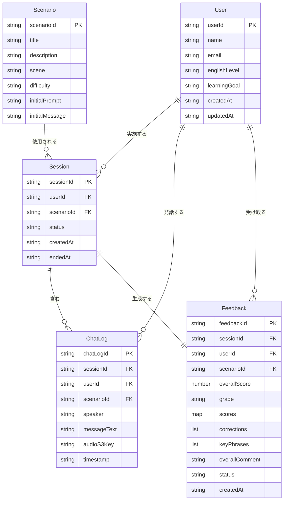

# IT-English Trainee (AWS Edition) データモデル定義書

## 1. ER図



---

## 2. 各エンティティの詳細定義

### 2.1 User（ユーザー）

| フィールド名 | 型 | 必須 | 制約 | 説明 |
|------------|---|:----:|------|------|
| `userId` | String | ✓ | PK、Cognito Sub と同一 | ユーザー一意識別子 |
| `name` | String | ✓ | 最大100文字 | ユーザー表示名 |
| `email` | String | ✓ | メール形式、一意 | メールアドレス |
| `englishLevel` | String | ✓ | `Beginner` / `Intermediate` / `Advanced` | 英語レベル |
| `learningGoal` | String | - | 最大500文字 | 学習目標テキスト |
| `createdAt` | String | ✓ | ISO 8601形式 | 作成日時 |
| `updatedAt` | String | ✓ | ISO 8601形式 | 更新日時 |

---

### 2.2 Scenario（シナリオ）

| フィールド名 | 型 | 必須 | 制約 | 説明 |
|------------|---|:----:|------|------|
| `scenarioId` | String | ✓ | PK、`SCN-001` 〜 `SCN-005` | シナリオ一意識別子 |
| `title` | String | ✓ | 最大100文字 | シナリオタイトル |
| `description` | String | ✓ | 最大500文字 | シナリオ説明文 |
| `scene` | String | ✓ | `朝会` / `業務中` / `終業前` | シーン区分 |
| `difficulty` | String | ✓ | `Beginner` / `Intermediate` / `Advanced` | 難易度 |
| `initialPrompt` | String | ✓ | 最大2000文字 | AIシステムプロンプト（ロール定義） |
| `initialMessage` | String | ✓ | 最大500文字 | AIの最初の発話テキスト |

**マスターデータ（初期投入）**

| scenarioId | title | scene | difficulty |
|-----------|-------|-------|-----------|
| SCN-001 | 進捗報告とブロック | 朝会 | Beginner |
| SCN-002 | 勤怠連絡 | 朝会 | Beginner |
| SCN-003 | 設計相談 | 業務中 | Intermediate |
| SCN-004 | バグ調査依頼 | 業務中 | Intermediate |
| SCN-005 | 残業・デプロイ確認 | 終業前 | Advanced |

---

### 2.3 Session（対話セッション）

| フィールド名 | 型 | 必須 | 制約 | 説明 |
|------------|---|:----:|------|------|
| `sessionId` | String | ✓ | PK、UUID v4 | セッション一意識別子 |
| `userId` | String | ✓ | GSI（PK）、UseruserId 参照 | ユーザーID |
| `scenarioId` | String | ✓ | Scenario.scenarioId 参照 | シナリオID |
| `status` | String | ✓ | `active` / `completed` / `abandoned` | セッション状態 |
| `createdAt` | String | ✓ | ISO 8601形式、GSI（SK） | 開始日時 |
| `endedAt` | String | - | ISO 8601形式 | 終了日時 |

---

### 2.4 ChatLog（対話ログ）

| フィールド名 | 型 | 必須 | 制約 | 説明 |
|------------|---|:----:|------|------|
| `chatLogId` | String | ✓ | PK、UUID v4 | ログ一意識別子 |
| `sessionId` | String | ✓ | GSI（PK）、Session.sessionId 参照 | セッションID |
| `userId` | String | ✓ | GSI（PK）、User.userId 参照 | ユーザーID |
| `scenarioId` | String | ✓ | Scenario.scenarioId 参照 | シナリオID |
| `speaker` | String | ✓ | `USER` / `AI` | 発話者種別 |
| `messageText` | String | ✓ | 最大2000文字 | 発話テキスト |
| `audioS3Key` | String | - | S3オブジェクトキー形式 | 音声ファイルのS3キー |
| `timestamp` | String | ✓ | ISO 8601形式、GSI（SK） | 発話日時 |

---

### 2.5 Feedback（フィードバック）

| フィールド名 | 型 | 必須 | 制約 | 説明 |
|------------|---|:----:|------|------|
| `feedbackId` | String | ✓ | PK、UUID v4 | フィードバック一意識別子 |
| `sessionId` | String | ✓ | GSI（PK）、Session.sessionId 参照、一意 | セッションID |
| `userId` | String | ✓ | GSI（PK）、User.userId 参照 | ユーザーID |
| `scenarioId` | String | ✓ | Scenario.scenarioId 参照 | シナリオID |
| `overallScore` | Number | ✓ | 0〜100の整数 | 総合スコア |
| `grade` | String | ✓ | `A` / `B` / `C` / `D` | グレード |
| `scores` | Map | ✓ | 下記スコア内訳参照 | スコア内訳 |
| `corrections` | List | ✓ | 下記添削リスト参照 | 添削リスト |
| `keyPhrases` | List | ✓ | 下記重要フレーズ参照 | 重要フレーズリスト |
| `overallComment` | String | ✓ | 最大1000文字 | AIの総評コメント（日本語） |
| `status` | String | ✓ | `generating` / `completed` / `failed` | 生成状態 |
| `createdAt` | String | ✓ | ISO 8601形式、GSI（SK） | 作成日時 |

**scores フィールド構造**

```json
{
  "grammar": 80,
  "fluency": 75,
  "itVocabulary": 79
}
```

**corrections リスト要素構造**

```json
{
  "original": "I found a critical bug",
  "improved": "I've identified a critical bug",
  "explanation": "現在完了形を使うことで、直前に発見したことをより自然に表現できます。"
}
```

**keyPhrases リスト要素構造**

```json
{
  "phrase": "I need to flag a blocker",
  "usage": "作業を妨げる問題（ブロッカー）を報告する際の定番フレーズ",
  "example": "I need to flag a blocker — the API endpoint is returning 500 errors."
}
```

---

## 3. DynamoDB テーブル設計

### 3.1 テーブル一覧

| テーブル名 | パーティションキー（PK） | ソートキー（SK） | 用途 |
|-----------|----------------------|----------------|------|
| `it-english-users` | `userId` (String) | - | ユーザー情報 |
| `it-english-scenarios` | `scenarioId` (String) | - | シナリオマスター |
| `it-english-sessions` | `sessionId` (String) | - | 対話セッション |
| `it-english-chatlogs` | `chatLogId` (String) | - | 対話ログ |
| `it-english-feedbacks` | `feedbackId` (String) | - | フィードバック |

---

### 3.2 GSI（グローバルセカンダリインデックス）一覧

#### it-english-sessions テーブル

| GSI名 | GSI-PK | GSI-SK | 射影属性 | 用途 |
|-------|--------|--------|---------|------|
| `userId-createdAt-index` | `userId` (String) | `createdAt` (String) | ALL | ユーザー別セッション一覧取得（日付降順） |
| `scenarioId-createdAt-index` | `scenarioId` (String) | `createdAt` (String) | ALL | シナリオ別セッション集計 |

#### it-english-chatlogs テーブル

| GSI名 | GSI-PK | GSI-SK | 射影属性 | 用途 |
|-------|--------|--------|---------|------|
| `sessionId-timestamp-index` | `sessionId` (String) | `timestamp` (String) | ALL | セッション内の会話ログ取得（時系列順） |
| `userId-timestamp-index` | `userId` (String) | `timestamp` (String) | KEYS_ONLY | ユーザー別発話数集計 |

#### it-english-feedbacks テーブル

| GSI名 | GSI-PK | GSI-SK | 射影属性 | 用途 |
|-------|--------|--------|---------|------|
| `userId-createdAt-index` | `userId` (String) | `createdAt` (String) | ALL | ユーザー別フィードバック履歴取得（日付降順） |
| `sessionId-index` | `sessionId` (String) | - | ALL | セッションIDからフィードバック取得 |
| `userId-scenarioId-index` | `userId` (String) | `scenarioId` (String) | KEYS_ONLY | ユーザー×シナリオ別スコア集計 |

---

### 3.3 キャパシティ設定

| テーブル名 | 読み取りモード | 書き込みモード | 備考 |
|-----------|-------------|-------------|------|
| `it-english-users` | オンデマンド | オンデマンド | アクセス頻度が低い |
| `it-english-scenarios` | プロビジョニング（RCU: 5） | プロビジョニング（WCU: 1） | マスターデータのため読み取り中心 |
| `it-english-sessions` | オンデマンド | オンデマンド | トレーニング頻度に依存 |
| `it-english-chatlogs` | オンデマンド | オンデマンド | 書き込みが最も多い |
| `it-english-feedbacks` | オンデマンド | オンデマンド | 生成に時間がかかるため非同期書き込み |

---

## 4. アクセスパターン一覧

| AP# | 操作 | テーブル / GSI | クエリ条件 | ソート | 使用画面 |
|-----|------|--------------|-----------|--------|---------|
| AP-01 | ユーザー情報取得 | `it-english-users` (PK) | `userId = :userId` | - | 全画面 |
| AP-02 | ユーザー情報更新 | `it-english-users` (PK) | `userId = :userId` | - | プロフィール編集 |
| AP-03 | シナリオ全件取得 | `it-english-scenarios` (Scan) | - | - | SCR-002 |
| AP-04 | シナリオ1件取得 | `it-english-scenarios` (PK) | `scenarioId = :scenarioId` | - | SCR-003 |
| AP-05 | セッション作成 | `it-english-sessions` (PK) | PUT | - | SCR-003 |
| AP-06 | セッション更新（終了） | `it-english-sessions` (PK) | `sessionId = :sessionId` | - | SCR-003 |
| AP-07 | ユーザー別セッション一覧 | `userId-createdAt-index` | `userId = :userId` | `createdAt` DESC | SCR-005 |
| AP-08 | 対話ログ追加 | `it-english-chatlogs` (PK) | PUT | - | SCR-003 |
| AP-09 | セッション内ログ取得 | `sessionId-timestamp-index` | `sessionId = :sessionId` | `timestamp` ASC | SCR-003, SCR-004 |
| AP-10 | フィードバック作成 | `it-english-feedbacks` (PK) | PUT | - | SCR-004 |
| AP-11 | フィードバック1件取得 | `it-english-feedbacks` (PK) | `feedbackId = :feedbackId` | - | SCR-004 |
| AP-12 | セッションIDでフィードバック取得 | `sessionId-index` | `sessionId = :sessionId` | - | SCR-004 |
| AP-13 | ユーザー別フィードバック履歴 | `userId-createdAt-index` | `userId = :userId` | `createdAt` DESC | SCR-005 |
| AP-14 | ユーザー×シナリオ別スコア集計 | `userId-scenarioId-index` | `userId = :userId AND scenarioId = :scenarioId` | - | SCR-001（推奨算出） |
| AP-15 | 直近7日間フィードバック取得 | `userId-createdAt-index` | `userId = :userId AND createdAt >= :7daysAgo` | `createdAt` DESC | SCR-001（ダッシュボード） |

---

## 5. S3 バケット構成

### 5.1 バケット一覧

| バケット名 | 用途 | リージョン | バージョニング |
|-----------|------|-----------|-------------|
| `it-english-trainee-audio-{env}` | 音声ファイル（Polly生成MP3） | ap-northeast-1 | 無効 |
| `it-english-trainee-assets-{env}` | 静的アセット（アプリビルド等） | ap-northeast-1 | 有効 |

> `{env}` は `dev` / `stg` / `prod` に置換する。

---

### 5.2 音声バケット（it-english-trainee-audio）オブジェクト構成

```
it-english-trainee-audio-{env}/
└── audio/
    └── {userId}/
        └── {sessionId}/
            ├── ai_{timestamp}.mp3       # AI発話音声（Polly生成）
            └── user_{timestamp}.mp3     # ユーザー発話音声（録音、任意保存）
```

**オブジェクトキー例**

```
audio/usr_abc123/ses_xyz789/ai_20250601T090130Z.mp3
audio/usr_abc123/ses_xyz789/user_20250601T090100Z.mp3
```

---

### 5.3 バケットポリシー・アクセス制御

| 項目 | 設定内容 |
|------|---------|
| パブリックアクセス | 全てブロック（Block Public Access: ON） |
| アクセス方式 | 署名付きURL（Presigned URL）のみ許可 |
| 署名付きURL有効期限 | 1時間（3600秒） |
| IAMロール | Lambda実行ロールに `s3:PutObject` / `s3:GetObject` を付与 |
| 暗号化 | SSE-S3（AES-256）によるサーバーサイド暗号化 |

---

### 5.4 ライフサイクルポリシー

| バケット | ルール | 対象プレフィックス | アクション |
|---------|--------|-----------------|-----------|
| `it-english-trainee-audio` | 古い音声の自動削除 | `audio/` | 作成から **90日後** に自動削除 |
| `it-english-trainee-audio` | Glacierへの移行 | `audio/` | 作成から **30日後** に S3 Glacier Instant Retrieval へ移行 |

---

## 6. データ整合性・運用方針

### 6.1 データ整合性

| 項目 | 方針 |
|------|------|
| トランザクション | DynamoDB TransactWrite を使用し、Session終了とFeedback作成を原子的に処理する |
| 孤立データ防止 | Session削除時は関連するChatLog・Feedbackも論理削除（`isDeleted: true`フラグ）する |
| フィードバック生成失敗 | `status: failed` を記録し、SQSデッドレターキューで再処理を試みる |

### 6.2 バックアップ方針

| 対象 | バックアップ方法 | 保持期間 |
|------|--------------|---------|
| DynamoDB全テーブル | Point-in-Time Recovery (PITR) 有効化 | 35日間 |
| DynamoDB全テーブル | オンデマンドバックアップ（週次） | 90日間 |
| S3音声バケット | S3バージョニング（assetsバケットのみ） | - |