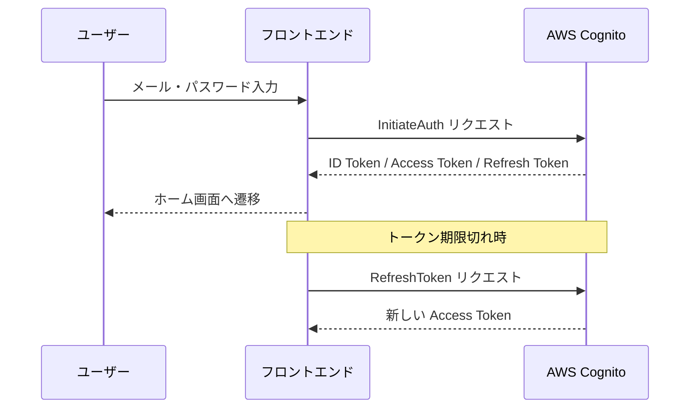
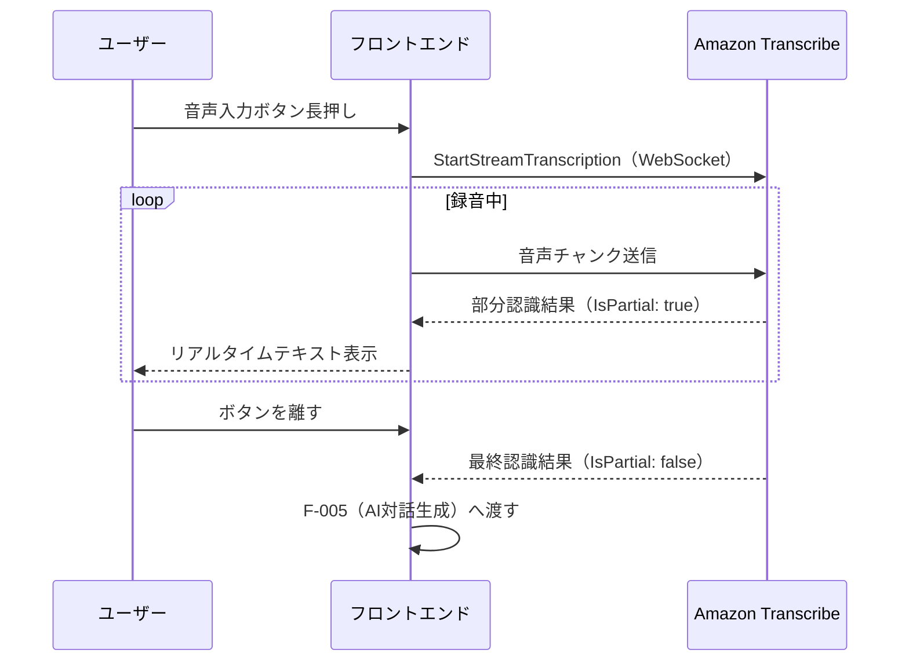
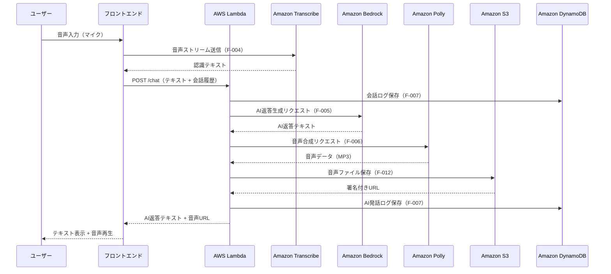

# IT-English Trainee (AWS Edition) 機能要件定義書

## 1. 機能一覧

| 機能ID | 機能名 | カテゴリ | 優先度 | 関連画面 |
|--------|--------|----------|--------|---------|
| F-001 | ユーザー認証 | 認証 | 必須 | ログイン画面 |
| F-002 | ユーザープロフィール管理 | ユーザー管理 | 必須 | SCR-001 |
| F-003 | シナリオ一覧取得 | シナリオ管理 | 必須 | SCR-002 |
| F-004 | 音声入力（STT） | 音声処理 | 必須 | SCR-003 |
| F-005 | AI対話生成 | 音声処理 | 必須 | SCR-003 |
| F-006 | 音声出力（TTS） | 音声処理 | 必須 | SCR-003 |
| F-007 | 対話ログ保存 | データ管理 | 必須 | SCR-003 |
| F-008 | フィードバック生成 | フィードバック | 必須 | SCR-004 |
| F-009 | 学習履歴取得 | データ管理 | 必須 | SCR-005 |
| F-010 | 進捗ダッシュボード | 分析 | 推奨 | SCR-001 |
| F-011 | 推奨シナリオ算出 | 分析 | 推奨 | SCR-001 |
| F-012 | 音声データS3保存 | インフラ | 必須 | SCR-003 |

---

## 2. 各機能の詳細仕様

### F-001 ユーザー認証

#### 概要
AWS Cognitoを利用したユーザー認証機能。サインアップ・ログイン・ログアウト・パスワードリセットを提供する。

#### 詳細仕様

| 項目 | 内容 |
|------|------|
| 入力 | メールアドレス、パスワード |
| 処理 | AWS Cognito User Pool による認証。JWTトークン（ID Token / Access Token / Refresh Token）を発行する |
| 出力 | JWTトークン（ローカルストレージに保存）、ユーザーID |

#### フロー



#### エラーハンドリング

| エラーコード | 内容 | ユーザー表示メッセージ |
|------------|------|-------------------|
| `UserNotFoundException` | ユーザーが存在しない | 「メールアドレスまたはパスワードが正しくありません」 |
| `NotAuthorizedException` | パスワード不一致 | 「メールアドレスまたはパスワードが正しくありません」 |
| `UserNotConfirmedException` | メール未確認 | 「メールアドレスの確認が完了していません」 |

---

### F-002 ユーザープロフィール管理

#### 概要
ユーザーの名前・英語レベル・学習目標を登録・更新する。

#### 詳細仕様

| 項目 | 内容 |
|------|------|
| 入力 | 名前（文字列）、英語レベル（Beginner / Intermediate / Advanced）、学習目標（テキスト、任意） |
| 処理 | DynamoDB の `User` テーブルへ登録・更新 |
| 出力 | 更新後のユーザーオブジェクト |

---

### F-003 シナリオ一覧取得

#### 概要
学習シナリオのマスターデータを取得し、シナリオ選択画面に表示する。

#### 詳細仕様

| 項目 | 内容 |
|------|------|
| 入力 | 難易度フィルター（任意）、ユーザーID |
| 処理 | DynamoDB の `Scenario` テーブルから全件取得。ユーザーの過去スコアを結合して返却 |
| 出力 | シナリオリスト（ID・タイトル・説明・難易度・最終スコア・最終実施日） |

---

### F-004 音声入力（STT）

#### 概要
Amazon Transcribeを使用し、ユーザーの発話音声をリアルタイムでテキスト化する。

#### 詳細仕様

| 項目 | 内容 |
|------|------|
| 入力 | マイク音声ストリーム（PCM 16kHz, 16bit, モノラル） |
| 処理 | Amazon Transcribe Streaming API（`StartStreamTranscription`）を使用。言語コード：`en-US` |
| 出力 | 認識テキスト（部分結果・最終結果） |

#### 処理フロー



#### 制約・注意事項

- 最大録音時間：60秒
- 無音検出：3秒間無音で自動停止
- 対応言語：英語（`en-US`）のみ

---

### F-005 AI対話生成

#### 概要
Amazon Bedrock（Claude 3.5 Sonnet）を使用し、シナリオに沿ったAIの返答テキストを生成する。

#### 詳細仕様

| 項目 | 内容 |
|------|------|
| 入力 | ユーザー発話テキスト、シナリオID、会話履歴（直近10ターン） |
| 処理 | Bedrock `InvokeModel` API を呼び出し。システムプロンプトにシナリオのロール定義を注入 |
| 出力 | AIの返答テキスト（英語） |

#### システムプロンプト構造

```
You are {AI_ROLE} in an IT workplace scenario
Scenario: {SCENARIO_DESCRIPTION}
Rules:
- Respond only in English
- Keep responses concise (2-4 sentences)
- Use natural IT workplace vocabulary
- Stay in character throughout the conversation
- If the user's English is unclear, ask for clarification naturally
```

#### Bedrock APIパラメータ

| パラメータ | 値 |
|-----------|---|
| `modelId` | `anthropic.claude-3-5-sonnet-20241022-v2:0` |
| `max_tokens` | `512` |
| `temperature` | `0.7` |
| `top_p` | `0.9` |

---

### F-006 音声出力（TTS）

#### 概要
Amazon Pollyを使用し、AIの返答テキストを自然な英語音声に変換して再生する。

#### 詳細仕様

| 項目 | 内容 |
|------|------|
| 入力 | AIの返答テキスト（英語） |
| 処理 | Polly `SynthesizeSpeech` API を呼び出し。音声データをS3に保存後、署名付きURLを返却 |
| 出力 | 音声ファイルの署名付きURL（MP3形式、有効期限：1時間） |

#### Polly APIパラメータ

| パラメータ | 値 |
|-----------|---|
| `VoiceId` | `Raveena`（インド英語アクセント） |
| `Engine` | `neural` |
| `OutputFormat` | `mp3` |
| `LanguageCode` | `en-IN` |

> **補足:** インド人エンジニアとの協業シナリオに合わせ、インド英語アクセントの音声を採用する。

---

### F-007 対話ログ保存

#### 概要
会話セッション中の全発話（ユーザー・AI）をDynamoDBに保存する。

#### 詳細仕様

| 項目 | 内容 |
|------|------|
| 入力 | ユーザーID、シナリオID、発話内容（テキスト）、発話者種別（USER / AI）、音声URL、タイムスタンプ |
| 処理 | DynamoDB の `ChatLog` テーブルへ書き込み。セッションIDで1会話をグルーピング |
| 出力 | 保存成功レスポンス（ChatLogID） |

---

### F-008 フィードバック生成

#### 概要
会話終了後、Amazon Bedrockを使用してユーザーの英語表現を分析し、添削・スコアリングを行う。

#### 詳細仕様

| 項目 | 内容 |
|------|------|
| 入力 | セッションの全会話ログ（ユーザー発話のみ抽出）、シナリオID |
| 処理 | Bedrock に専用フィードバックプロンプトを送信し、JSON形式でスコア・添削・フレーズを取得 |
| 出力 | フィードバックオブジェクト（総合スコア・内訳スコア・添削リスト・重要フレーズ・AIコメント） |

#### フィードバックプロンプト構造

```
You are an English language coach specializing in IT workplace communication.
Analyze the following conversation and provide feedback in JSON format.

Conversation:
{CONVERSATION_LOG}

Provide feedback with the following structure:
{
  "overall_score": <0-100>,
  "scores": {
    "grammar": <0-100>,
    "fluency": <0-100>,
    "it_vocabulary": <0-100>
  },
  "corrections": [
    {
      "original": "<ユーザーの元の表現>",
      "improved": "<改善提案>",
      "explanation": "<解説（日本語）>"
    }
  ],
  "key_phrases": [
    {
      "phrase": "<重要フレーズ>",
      "usage": "<使い方の説明（日本語）>",
      "example": "<例文>"
    }
  ],
  "overall_comment": "<総評（日本語）>"
}
```

#### スコア算出基準

| 評価軸 | 評価内容 |
|--------|---------|
| 文法（grammar） | 時制・冠詞・前置詞・語順の正確さ |
| 流暢さ（fluency） | 自然な言い回し・会話の流れへの適応度 |
| IT用語（it_vocabulary） | IT現場で適切な専門用語の使用度 |

#### グレード基準

| スコア | グレード |
|--------|---------|
| 90〜100 | A |
| 75〜89 | B |
| 60〜74 | C |
| 0〜59 | D |

---

### F-009 学習履歴取得

#### 概要
ユーザーの過去のトレーニング結果一覧を取得する。

#### 詳細仕様

| 項目 | 内容 |
|------|------|
| 入力 | ユーザーID、シナリオIDフィルター（任意）、期間フィルター（任意）、ページネーション（limit / offset） |
| 処理 | DynamoDB の `Feedback` テーブルをユーザーIDでクエリ。日付降順でソート |
| 出力 | 履歴リスト（実施日時・シナリオ名・総合スコア・グレード） |

---

### F-010 進捗ダッシュボード

#### 概要
ユーザーの学習進捗を集計し、ホーム画面に表示する。

#### 詳細仕様

| 項目 | 内容 |
|------|------|
| 入力 | ユーザーID |
| 処理 | 直近7日間のフィードバックデータを集計。学習回数・平均スコア・連続学習日数を算出 |
| 出力 | 進捗サマリーオブジェクト（学習回数・平均スコア・連続日数・日別スコア推移） |

---

### F-011 推奨シナリオ算出

#### 概要
ユーザーの過去スコアを分析し、最も練習が必要なシナリオを推奨する。

#### 詳細仕様

| 項目 | 内容 |
|------|------|
| 入力 | ユーザーID |
| 処理 | シナリオ別の平均スコアを算出し、最低スコアのシナリオを推奨。未挑戦シナリオは最優先で推奨 |
| 出力 | 推奨シナリオID・推奨理由テキスト |

---

### F-012 音声データS3保存

#### 概要
Pollyが生成した音声ファイルをS3に保存し、管理する。

#### 詳細仕様

| 項目 | 内容 |
|------|------|
| 入力 | 音声データ（MP3）、ユーザーID、セッションID |
| 処理 | S3バケットへアップロード。パス：`audio/{userId}/{sessionId}/{timestamp}.mp3` |
| 出力 | S3オブジェクトキー、署名付きURL（有効期限：1時間） |

---

## 3. 音声処理フロー（統合）



---

## 4. API仕様

### 4.1 共通仕様

| 項目 | 内容 |
|------|------|
| ベースURL | `https://api.it-english-trainee.example.com/v1` |
| 認証方式 | Bearer Token（Cognito ID Token） |
| Content-Type | `application/json` |
| 文字コード | UTF-8 |

#### 共通レスポンス形式

```json
{
  "success": true,
  "data": {},
  "error": null
}
```

#### 共通エラーレスポンス形式

```json
{
  "success": false,
  "data": null,
  "error": {
    "code": "ERROR_CODE",
    "message": "エラーメッセージ"
  }
}
```

---

### 4.2 エンドポイント一覧

#### ユーザー管理

---

**GET /users/me**

ログインユーザーのプロフィールを取得する。

- **認証:** 必須
- **リクエスト:** なし

**レスポンス（200）**

```json
{
  "success": true,
  "data": {
    "userId": "usr_abc123",
    "name": "田中 太郎",
    "englishLevel": "Intermediate",
    "learningGoal": "インド人エンジニアとスムーズに会話できるようになる",
    "createdAt": "2025-01-01T00:00:00Z"
  }
}
```

---

**PUT /users/me**

ログインユーザーのプロフィールを更新する。

- **認証:** 必須

**リクエストボディ**

```json
{
  "name": "田中 太郎",
  "englishLevel": "Intermediate",
  "learningGoal": "インド人エンジニアとスムーズに会話できるようになる"
}
```

**レスポンス（200）**

```json
{
  "success": true,
  "data": {
    "userId": "usr_abc123",
    "name": "田中 太郎",
    "englishLevel": "Intermediate",
    "updatedAt": "2025-06-01T10:00:00Z"
  }
}
```

---

#### シナリオ管理

---

**GET /scenarios**

シナリオ一覧を取得する。

- **認証:** 必須

**クエリパラメータ**

| パラメータ | 型 | 必須 | 説明 |
|-----------|---|------|------|
| `difficulty` | string | 任意 | `Beginner` / `Intermediate` / `Advanced` |

**レスポンス（200）**

```json
{
  "success": true,
  "data": {
    "scenarios": [
      {
        "scenarioId": "SCN-001",
        "title": "進捗報告とブロック",
        "description": "予期せぬバグによる遅延報告と、今日の予定調整。",
        "scene": "朝会",
        "difficulty": "Beginner",
        "lastScore": 82,
        "lastPlayedAt": "2025-05-30T09:00:00Z"
      }
    ]
  }
}
```

---

#### 対話セッション管理

---

**POST /sessions**

新しい対話セッションを開始する。

- **認証:** 必須

**リクエストボディ**

```json
{
  "scenarioId": "SCN-001"
}
```

**レスポンス（201）**

```json
{
  "success": true,
  "data": {
    "sessionId": "ses_xyz789",
    "scenarioId": "SCN-001",
    "initialMessage": "Good morning! Ready for the standup? What's your update today?",
    "audioUrl": "https://s3.amazonaws.com/...signed-url...",
    "createdAt": "2025-06-01T09:00:00Z"
  }
}
```

---

**POST /sessions/{sessionId}/chat**

ユーザーの発話を送信し、AIの返答を取得する。

- **認証:** 必須

**パスパラメータ**

| パラメータ | 型 | 説明 |
|-----------|---|------|
| `sessionId` | string | セッションID |

**リクエストボディ**

```json
{
  "userMessage": "I'm sorry, I found a critical bug in the payment module. It will take at least 2 more days.",
  "messageType": "text"
}
```

**レスポンス（200）**

```json
{
  "success": true,
  "data": {
    "chatLogId": "log_def456",
    "aiMessage": "I see That's quite serious. Have you already informed the project manager about this delay?",
    "audioUrl": "https://s3.amazonaws.com/...signed-url...",
    "translation": "なるほど、それは深刻ですね。この遅延についてはすでにプロジェクトマネージャーに報告しましたか？",
    "timestamp": "2025-06-01T09:01:30Z"
  }
}
```

---

**POST /sessions/{sessionId}/end**

対話セッションを終了し、フィードバック生成をトリガーする。

- **認証:** 必須

**レスポンス（200）**

```json
{
  "success": true,
  "data": {
    "sessionId": "ses_xyz789",
    "feedbackId": "fbk_ghi012",
    "status": "generating"
  }
}
```

---

#### フィードバック

---

**GET /feedbacks/{feedbackId}**

フィードバック結果を取得する。

- **認証:** 必須

**レスポンス（200）**

```json
{
  "success": true,
  "data": {
    "feedbackId": "fbk_ghi012",
    "sessionId": "ses_xyz789",
    "scenarioId": "SCN-001",
    "overallScore": 78,
    "grade": "B",
    "scores": {
      "grammar": 80,
      "fluency": 75,
      "itVocabulary": 79
    },
    "corrections": [
      {
        "original": "I found a critical bug",
        "improved": "I've identified a critical bug",
        "explanation": "現在完了形を使うことで、直前に発見したことをより自然に表現できます。"
      }
    ],
    "keyPhrases": [
      {
        "phrase": "I need to flag a blocker",
        "usage": "作業を妨げる問題（ブロッカー）を報告する際の定番フレーズ",
        "example": "I need to flag a blocker — the API endpoint is returning 500 errors."
      }
    ],
    "overallComment": "全体的に意思疎通はできていますが、IT現場特有のフレーズ（blocker, ETA, workaround など）を積極的に使うとより自然な会話になります。",
    "status": "completed",
    "createdAt": "2025-06-01T09:10:00Z"
  }
}
```

---

#### 学習履歴

---

**GET /users/me/history**

学習履歴一覧を取得する。

- **認証:** 必須

**クエリパラメータ**

| パラメータ | 型 | 必須 | 説明 |
|-----------|---|------|------|
| `scenarioId` | string | 任意 | シナリオIDで絞り込み |
| `period` | string | 任意 | `7d` / `30d` / `all`（デフォルト：`30d`） |
| `limit` | integer | 任意 | 取得件数（デフォルト：20） |
| `offset` | integer | 任意 | オフセット（デフォルト：0） |

**レスポンス（200）**

```json
{
  "success": true,
  "data": {
    "summary": {
      "totalCount": 15,
      "averageScore": 76,
      "highestScore": 92,
      "streakDays": 5
    },
    "history": [
      {
        "feedbackId": "fbk_ghi012",
        "scenarioId": "SCN-001",
        "scenarioTitle": "進捗報告とブロック",
        "overallScore": 78,
        "grade": "B",
        "playedAt": "2025-06-01T09:00:00Z"
      }
    ],
    "total": 15,
    "limit": 20,
    "offset": 0
  }
}
```

---

**GET /users/me/dashboard**

進捗ダッシュボードデータを取得する。

- **認証:** 必須

**レスポンス（200）**

```json
{
  "success": true,
  "data": {
    "weeklyCount": 7,
    "streakDays": 5,
    "averageScore": 76,
    "dailyScores": [
      { "date": "2025-05-26", "score": 70 },
      { "date": "2025-05-27", "score": 74 },
      { "date": "2025-05-28", "score": 78 },
      { "date": "2025-05-29", "score": 75 },
      { "date": "2025-05-30", "score": 82 },
      { "date": "2025-05-31", "score": null },
      { "date": "2025-06-01", "score": 78 }
    ],
    "recommendedScenario": {
      "scenarioId": "SCN-003",
      "title": "設計相談",
      "reason": "IT用語スコアが最も低いシナリオです。重点的に練習しましょう。"
    }
  }
}
```

---

## 5. データモデル

### 5.1 User テーブル

| フィールド名 | 型 | 必須 | 説明 |
|------------|---|------|------|
| `userId` | String (PK) | ✓ | Cognito Sub をそのまま使用 |
| `name` | String | ✓ | ユーザー表示名 |
| `email` | String | ✓ | メールアドレス |
| `englishLevel` | String | ✓ | `Beginner` / `Intermediate` / `Advanced` |
| `learningGoal` | String | - | 学習目標テキスト |
| `createdAt` | String (ISO8601) | ✓ | 作成日時 |
| `updatedAt` | String (ISO8601) | ✓ | 更新日時 |

### 5.2 Scenario テーブル

| フィールド名 | 型 | 必須 | 説明 |
|------------|---|------|------|
| `scenarioId` | String (PK) | ✓ | `SCN-001` 〜 `SCN-005` |
| `title` | String | ✓ | シナリオタイトル |
| `description` | String | ✓ | シナリオ説明文 |
| `scene` | String | ✓ | `朝会` / `業務中` / `終業前` |
| `difficulty` | String | ✓ | `Beginner` / `Intermediate` / `Advanced` |
| `initialPrompt` | String | ✓ | AIのシステムプロンプト（ロール定義） |
| `initialMessage` | String | ✓ | AIの最初の発話テキスト |

### 5.3 ChatLog テーブル

| フィールド名 | 型 | 必須 | 説明 |
|------------|---|------|------|
| `chatLogId` | String (PK) | ✓ | UUID |
| `sessionId` | String (GSI) | ✓ | セッションID |
| `userId` | String (GSI) | ✓ | ユーザーID |
| `scenarioId` | String | ✓ | シナリオID |
| `speaker` | String | ✓ | `USER` / `AI` |
| `messageText` | String | ✓ | 発話テキスト |
| `audioS3Key` | String | - | S3オブジェクトキー |
| `timestamp` | String (ISO8601) | ✓ | 発話日時 |

### 5.4 Feedback テーブル

| フィールド名 | 型 | 必須 | 説明 |
|------------|---|------|------|
| `feedbackId` | String (PK) | ✓ | UUID |
| `sessionId` | String (GSI) | ✓ | セッションID |
| `userId` | String (GSI) | ✓ | ユーザーID |
| `scenarioId` | String | ✓ | シナリオID |
| `overallScore` | Number | ✓ | 総合スコア（0〜100） |
| `grade` | String | ✓ | `A` / `B` / `C` / `D` |
| `scores` | Map | ✓ | `grammar` / `fluency` / `itVocabulary` |
| `corrections` | List | ✓ | 添削リスト |
| `keyPhrases` | List | ✓ | 重要フレーズリスト |
| `overallComment` | String | ✓ | AIの総評コメント |
| `status` | String | ✓ | `generating` / `completed` / `failed` |
| `createdAt` | String (ISO8601) | ✓ | 作成日時 |

---

## 6. 非機能要件

### 6.1 パフォーマンス要件

| 項目 | 目標値 |
|------|--------|
| STT認識レイテンシ | 発話終了から1秒以内に最終テキスト返却 |
| AI返答生成時間 | 3秒以内（Bedrock呼び出し含む） |
| TTS音声生成時間 | 2秒以内 |
| API応答時間（音声処理以外） | 500ms以内 |
| フィードバック生成時間 | 10秒以内 |

### 6.2 セキュリティ要件

| 項目 | 内容 |
|------|------|
| 認証 | 全APIエンドポイントでCognito JWTトークン検証を必須とする |
| 認可 | ユーザーは自身のデータのみアクセス可能（Lambda内でuserIdを検証） |
| 通信暗号化 | 全通信をHTTPS（TLS 1.2以上）で暗号化 |
| S3アクセス | 音声ファイルは署名付きURLのみでアクセス。バケットへの直接パブリックアクセスは禁止 |
| 機密情報管理 | AWSクレデンシャル・APIキーはAWS Secrets Managerで管理 |

### 6.3 可用性・スケーラビリティ

| 項目 | 内容 |
|------|------|
| 可用性目標 | 99.9%（月間ダウンタイム：約44分以内） |
| スケーリング | Lambda・DynamoDBのオートスケーリングにより、同時接続数の増加に自動対応 |
| リージョン | `ap-northeast-1`（東京）をプライマリとする |