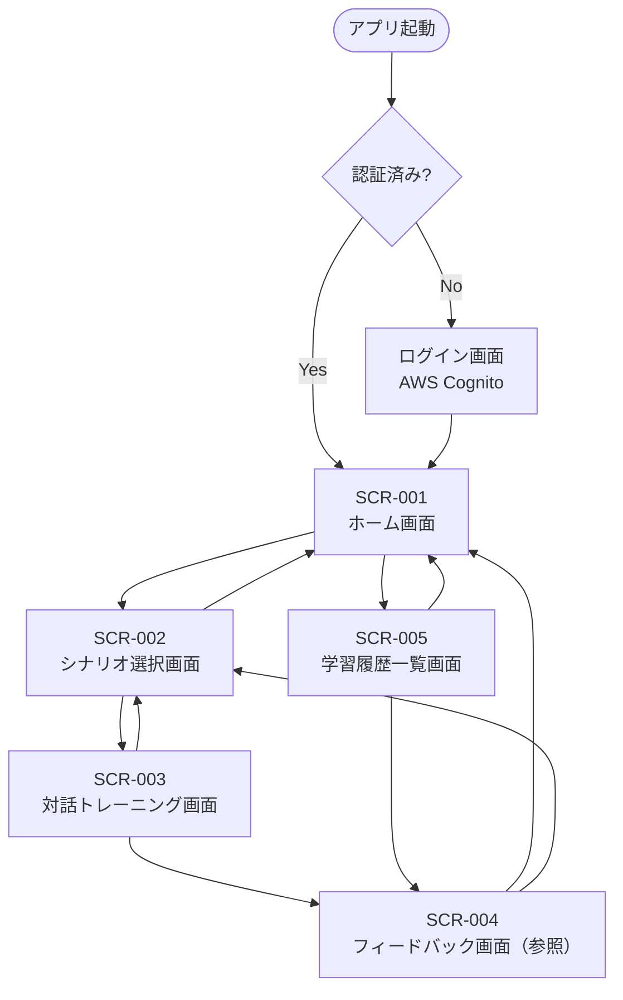

# IT-English Trainee (AWS Edition) 画面設計書

## 1. 画面一覧

| 画面ID | 画面名 | 概要 |
|--------|--------|------|
| SCR-001 | ホーム画面 | 今日の推奨シナリオと学習ステータスの表示 |
| SCR-002 | シナリオ選択画面 | 5つの基本シナリオおよび難易度の選択 |
| SCR-003 | 対話トレーニング画面 | AIとのチャット／音声対話UI |
| SCR-004 | フィードバック画面 | 添削結果・重要フレーズ解説・評価スコアの表示 |
| SCR-005 | 学習履歴一覧画面 | 過去のトレーニング結果のリスト表示 |

---

## 2. 画面遷移図

---

## 3. 各画面UI仕様

### SCR-001 ホーム画面

#### 3.1.1 表示要素

| 要素ID | 要素名 | 種別 | 内容・仕様 |
|--------|--------|------|-----------|
| H-01 | ヘッダー | コンポーネント | アプリロゴ、ユーザーアイコン（タップでプロフィール） |
| H-02 | 挨拶テキスト | テキスト | 「Good morning, {ユーザー名}!」など時間帯に応じた挨拶 |
| H-03 | 学習ステータスカード | カード | 今週の学習回数、連続学習日数、総合スコア平均を表示 |
| H-04 | 今日の推奨シナリオ | カード | シナリオタイトル・難易度バッジ・推奨理由テキスト |
| H-05 | クイックスタートボタン | ボタン | 推奨シナリオを即座に開始する |
| H-06 | シナリオ一覧へのリンク | ボタン | SCR-002へ遷移 |
| H-07 | 学習履歴へのリンク | ボタン | SCR-005へ遷移 |
| H-08 | 進捗グラフ | グラフ | 直近7日間のスコア推移（折れ線グラフ） |

#### 3.1.2 操作

| 操作 | 遷移先 / アクション |
|------|-------------------|
| クイックスタートボタン押下 | SCR-003（推奨シナリオで開始） |
| シナリオ一覧ボタン押下 | SCR-002 |
| 学習履歴ボタン押下 | SCR-005 |
| ユーザーアイコンタップ | プロフィール編集モーダル表示 |

#### 3.1.3 状態

| 状態 | 表示内容 |
|------|---------|
| 初回ログイン | 推奨シナリオ：SCN-001（朝会・進捗報告）、スコアは「-」表示 |
| 学習データあり | 苦手シチュエーションを優先して推奨シナリオを決定 |
| オフライン | バナーで「オフラインです」を表示、操作を無効化 |

---

### SCR-002 シナリオ選択画面

#### 3.2.1 表示要素

| 要素ID | 要素名 | 種別 | 内容・仕様 |
|--------|--------|------|-----------|
| S-01 | ページタイトル | テキスト | 「シナリオを選ぶ」 |
| S-02 | 難易度フィルター | タブ | Beginner / Intermediate / Advanced |
| S-03 | シナリオカードリスト | リスト | 各シナリオのカードを縦並びで表示 |
| S-04 | シナリオカード | カード | タイトル、シーン（朝会/業務中/終業前）、難易度バッジ、説明文（2行）、最終スコア |
| S-05 | 戻るボタン | ボタン | SCR-001へ戻る |

**シナリオ一覧（固定）**

| シナリオID | タイトル | シーン | 難易度 |
|-----------|---------|--------|--------|
| SCN-001 | 進捗報告とブロック | 朝会 | Beginner |
| SCN-002 | 勤怠連絡 | 朝会 | Beginner |
| SCN-003 | 設計相談 | 業務中 | Intermediate |
| SCN-004 | バグ調査依頼 | 業務中 | Intermediate |
| SCN-005 | 残業・デプロイ確認 | 終業前 | Advanced |

#### 3.2.2 操作

| 操作 | 遷移先 / アクション |
|------|-------------------|
| シナリオカードタップ | SCR-003（選択シナリオで開始） |
| 難易度タブ切替 | 該当難易度のシナリオのみ表示 |
| 戻るボタン押下 | SCR-001 |

#### 3.2.3 状態

| 状態 | 表示内容 |
|------|---------|
| 未挑戦シナリオ | 最終スコア欄に「未挑戦」バッジ表示 |
| 挑戦済みシナリオ | 最終スコア（例：82点）と最終実施日を表示 |

---

### SCR-003 対話トレーニング画面

#### 3.3.1 表示要素

| 要素ID | 要素名 | 種別 | 内容・仕様 |
|--------|--------|------|-----------|
| T-01 | シナリオタイトルバー | ヘッダー | シナリオ名・難易度バッジ・終了ボタン |
| T-02 | 状況説明テキスト | テキスト | シナリオの背景説明（例：「今日の朝会でバグによる遅延を報告してください」） |
| T-03 | 翻訳表示切替トグル | トグル | ON：日本語訳を吹き出し下に表示 / OFF：英語のみ |
| T-04 | 対話ログエリア | スクロールビュー | ユーザー発話（右）・AI発話（左）を吹き出し形式で表示 |
| T-05 | AI発話吹き出し | コンポーネント | テキスト、音声再生ボタン、（翻訳ON時）日本語訳 |
| T-06 | ユーザー発話吹き出し | コンポーネント | テキスト（STT変換結果）、（翻訳ON時）日本語訳 |
| T-07 | 音声入力ボタン | ボタン | 押下中：録音中（赤色アニメーション）/ 離す：送信 |
| T-08 | テキスト入力フィールド | テキストフィールド | 音声入力の代替としてテキスト直接入力も可能 |
| T-09 | 送信ボタン | ボタン | テキスト入力内容を送信 |
| T-10 | 処理中インジケーター | ローディング | AI応答生成中・Polly音声生成中に表示 |
| T-11 | 会話終了ボタン | ボタン | 任意のタイミングで会話を終了しフィードバックへ |

#### 3.3.2 操作

| 操作 | 遷移先 / アクション |
|------|-------------------|
| 音声入力ボタン長押し | Amazon Transcribeによる録音開始 |
| 音声入力ボタン離す | 録音停止 → STTテキスト化 → Bedrock送信 → Polly音声再生 |
| テキスト送信 | Bedrock送信 → Polly音声再生 |
| AI吹き出しの音声再生ボタン | Polly生成音声を再生 |
| 翻訳トグル切替 | 全吹き出しの日本語訳表示/非表示を切替 |
| 会話終了ボタン押下 | SCR-004へ遷移（会話ログをDBに保存） |
| 終了ボタン（ヘッダー）押下 | 確認ダイアログ表示 → 「終了」でSCR-002へ戻る |

#### 3.3.3 状態

| 状態 | 表示内容 |
|------|---------|
| 待機中 | 音声入力ボタン：グレー（通常） |
| 録音中 | 音声入力ボタン：赤色・波形アニメーション表示 |
| AI応答生成中 | T-10ローディング表示、入力ボタン無効化 |
| 音声再生中 | AI吹き出しにハイライト表示 |
| エラー（STT失敗） | 「音声を認識できませんでした。もう一度お試しください」トースト表示 |
| エラー（API失敗） | 「通信エラーが発生しました」トースト表示、再試行ボタン表示 |

---

### SCR-004 フィードバック画面

#### 3.4.1 表示要素

| 要素ID | 要素名 | 種別 | 内容・仕様 |
|--------|--------|------|-----------|
| F-01 | ページタイトル | テキスト | 「フィードバック」 |
| F-02 | 総合スコアカード | カード | 総合スコア（100点満点）、グレード（A/B/C/D） |
| F-03 | スコア内訳 | レーダーチャート | 文法・流暢さ・IT用語の適切さの3軸 |
| F-04 | 添削セクション | リスト | ユーザー発話ごとに「元の表現」→「改善提案」→「解説」を表示 |
| F-05 | 重要フレーズ解説 | カードリスト | 今回の会話で使うべきIT現場フレーズを3〜5件ピックアップ |
| F-06 | AIコメント | テキストエリア | 会話全体に対するAIの総評コメント |
| F-07 | もう一度挑戦ボタン | ボタン | 同シナリオでSCR-003を再開 |
| F-08 | 別シナリオを選ぶボタン | ボタン | SCR-002へ遷移 |
| F-09 | ホームへ戻るボタン | ボタン | SCR-001へ遷移 |

#### 3.4.2 操作

| 操作 | 遷移先 / アクション |
|------|-------------------|
| もう一度挑戦ボタン押下 | SCR-003（同シナリオ・新規セッション） |
| 別シナリオを選ぶボタン押下 | SCR-002 |
| ホームへ戻るボタン押下 | SCR-001 |
| 添削アイテムタップ | 詳細モーダル表示（元発話・改善案・解説の全文） |
| 重要フレーズカードタップ | フレーズ詳細モーダル（例文・発音ガイド） |

#### 3.4.3 状態

| 状態 | 表示内容 |
|------|---------|
| フィードバック生成中 | スケルトンローディング表示 |
| フィードバック完了 | 全要素を表示 |
| 履歴参照モード（SCR-005から遷移） | F-07・F-08・F-09の代わりに「閉じる」ボタンのみ表示 |

---

### SCR-005 学習履歴一覧画面

#### 3.5.1 表示要素

| 要素ID | 要素名 | 種別 | 内容・仕様 |
|--------|--------|------|-----------|
| L-01 | ページタイトル | テキスト | 「学習履歴」 |
| L-02 | サマリーカード | カード | 総学習回数・平均スコア・最高スコア |
| L-03 | シナリオ別フィルター | ドロップダウン | 全シナリオ / SCN-001〜005 |
| L-04 | 期間フィルター | ドロップダウン | 直近7日 / 直近30日 / 全期間 |
| L-05 | 履歴リスト | リスト | 履歴カードを日付降順で表示 |
| L-06 | 履歴カード | カード | 実施日時・シナリオ名・総合スコア・グレードバッジ |
| L-07 | 戻るボタン | ボタン | SCR-001へ戻る |

#### 3.5.2 操作

| 操作 | 遷移先 / アクション |
|------|-------------------|
| 履歴カードタップ | SCR-004（履歴参照モード） |
| フィルター変更 | リストを絞り込み表示（API再取得） |
| 戻るボタン押下 | SCR-001 |

#### 3.5.3 状態

| 状態 | 表示内容 |
|------|---------|
| 履歴なし | 「まだ学習履歴がありません。さっそく始めましょう！」と開始ボタン表示 |
| 読み込み中 | スケルトンローディング表示 |
| データあり | 履歴リストを表示 |

---

## 4. 共通UI仕様

### 4.1 ナビゲーション

| 要素 | 仕様 |
|------|------|
| ボトムナビゲーション | ホーム・シナリオ・履歴の3タブ（対話トレーニング中は非表示） |
| 戻るジェスチャー | OS標準の戻るジェスチャーに対応 |

### 4.2 カラーパレット（案）

| 用途 | カラーコード |
|------|------------|
| プライマリ | `#1A73E8`（ブルー） |
| セカンダリ | `#34A853`（グリーン） |
| 警告 | `#EA4335`（レッド） |
| 背景 | `#F8F9FA` |
| テキスト（主） | `#202124` |
| テキスト（副） | `#5F6368` |

### 4.3 エラー・通知共通仕様

| 種別 | 表示方法 |
|------|---------|
| 成功通知 | 画面上部グリーントースト（3秒で自動消去） |
| 警告通知 | 画面上部イエロートースト（タップで消去） |
| エラー通知 | 画面上部レッドトースト（タップで消去） |
| 致命的エラー | フルスクリーンエラー画面（再試行ボタン付き） |